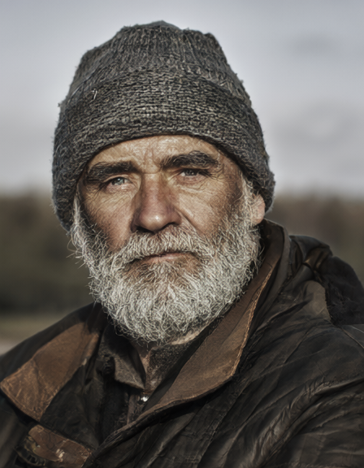
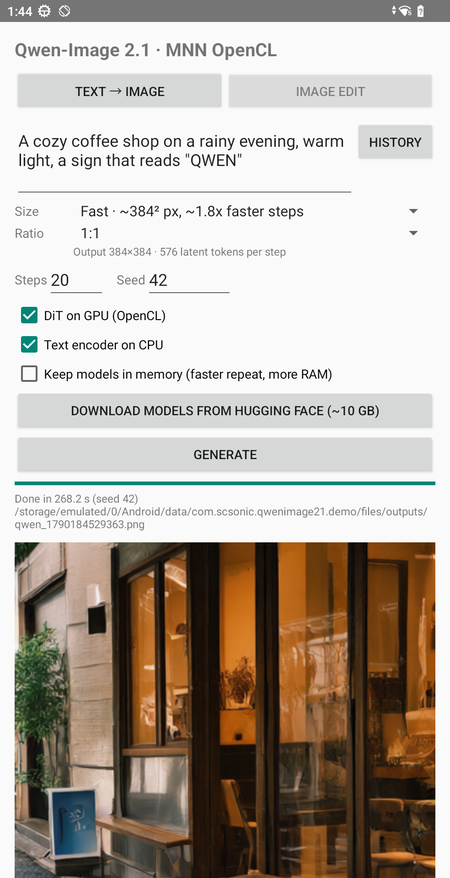
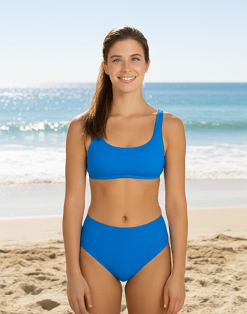
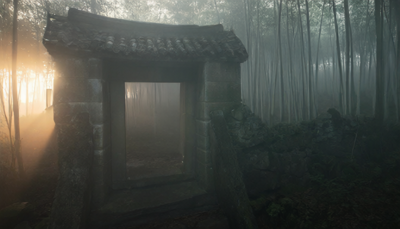
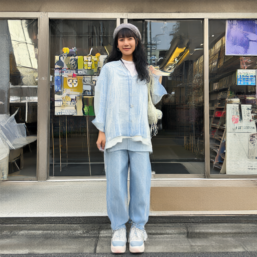

# libQwenImage21 — Qwen-Image-2.1 on Android

Run [Qwen-Image-2.1](https://huggingface.co/Qwen/Qwen-Image-2.1) **text-to-image and image editing fully on-device**
on Android, with [MNN](https://github.com/alibaba/MNN), int4 weights and the OpenCL GPU backend.

**[中文說明 ↓](#中文說明)**

This repo has an Android library (`qwenimage21`, AAR), a demo app, an adb CLI, and the model conversion scripts.
Converted models: **[evankuo/Qwen-Image-2.1-MNN](https://huggingface.co/evankuo/Qwen-Image-2.1-MNN)**.
Prebuilt APK/AAR: **[Releases](https://github.com/scsonic/libQwenImage21/releases)**.

<p>




</p>

**Image editing** — one generated photo (left) as input, three prompts that change only the clothes. 20 more outfit
and pose edits of the same photo: **[docs/GALLERY.md](docs/GALLERY.md)**.

<p>




</p>

<p>



</p>

*All generated on the phone (Snapdragon 8 Gen 2), 20 steps. See [Sizes](#sizes) for the size grid.*

**Turbo (experimental)** — the [Viggle-turbo](https://huggingface.co/Viggle/Qwen-Image-2.1-viggle-turbo) LoRA in 6
steps instead of 20–40, about half the time end to end. Left three: text-to-image. Right three: editing the first
one into different outfits. Details, more samples and per-step timings: **[docs/TURBO.md](docs/TURBO.md)**.

<p>





</p>

## Status

| | |
|---|---|
| Modes | text-to-image, image editing (1–2 reference images — [docs/MULTI_REF.md](docs/MULTI_REF.md)) |
| Resolution | any size, sides a multiple of 32, 256×256 up; 7 ratios × 3 pixel budgets in the UI ([Sizes](#sizes)). The model itself trained past 1 megapixel — the UI caps out around ~512² because that's what this phone's RAM can sustain, not a model limit |
| Tested device | Snapdragon 8 Gen 2 (Adreno 740), 16 GB RAM, Android 13 |
| Speed | ~19 s/step on OpenCL fp16 at ~512² · ~451 s for 20 steps end to end |
| Model download | ~10.3 GB (text encoder + vision 5.4 GB, DiT 4.5 GB, VAE 0.7 GB) |
| Requirements | arm64 Android 8.0+ (API 26), OpenCL GPU, **12 GB+ RAM recommended**, ~11 GB free storage |
| Turbo (experimental) | [Viggle-turbo](https://huggingface.co/Viggle/Qwen-Image-2.1-viggle-turbo) LoRA, unmerged: 6 steps instead of 20–40, ~half the total time, +5.2 GB (own copy of the base weights + the LoRA). Opt-in in the app (a download checkbox + a Turbo LoRA checkbox) — [docs/TURBO.md](docs/TURBO.md) |
| Multi-reference editing (experimental) | A 2nd reference image, no new model files. Each reference can be independently shrunk to save RAM/time — [docs/MULTI_REF.md](docs/MULTI_REF.md) |

| 20 steps | text encoder | K/V prefix | DiT | VAE | total |
|---|---|---|---|---|---|
| Text to image, 448×576 | 22 s | 2.7 s (P=58) | 20×19.1 s | 18 s | **451 s** |
| Edit → 352×448 (Fast) | 67 s (+vision) | 17 s (P=672) | 20×12.6 s | 13 s | **348 s** |
| Edit → 448×576 (Standard) | 80 s | 26 s (P=1064) | 20×21.4 s | 22 s | **556 s** |

| Turbo, 6 steps | text encoder + prefix | DiT | VAE | total |
|---|---|---|---|---|
| Text to image, 448×576–512×512 | ~15 s | 6×~22 s ≈ 134 s | ~18 s | **~216–235 s** |
| Edit, 1 reference → 352×448 | ~20 s (+vision, P≈680) | 6×~18 s ≈ 108 s | ~13 s | **~196–200 s** |
| Edit, 2 references (half scale), ~448×576–672×384 | ~70 s (+2× vision, +2× VAE-encode, P~1100) | 6×~27 s ≈ 161 s | ~22 s | **257–275 s** |

An edit step is slower than a text-to-image step at the same size because attention also runs over the condition
image's tokens (P+N keys instead of N); a 2nd reference adds more of the same. See [docs/TURBO.md](docs/TURBO.md),
[docs/MULTI_REF.md](docs/MULTI_REF.md) and [Limitations](#limitations).

## Quick start (demo app)

1. Install: grab the APK from [Releases](https://github.com/scsonic/libQwenImage21/releases), or build it:
   ```bash
   git clone https://github.com/scsonic/libQwenImage21.git && cd libQwenImage21
   ./gradlew :demo:installDebug
   ```
2. Get the models — in the app, check **Standard** and/or **Turbo** (see [docs/TURBO.md](docs/TURBO.md))
   and tap **Download models from Hugging Face** (resumable, checksum-verified), or from a computer:
   ```bash
   hf download evankuo/Qwen-Image-2.1-MNN --local-dir models/qwen_image21 --exclude "dit_turbo.mnn*"  # +turbo: drop --exclude
   scripts/push_models.sh models/qwen_image21
   ```
3. Pick **Text → Image** or **Image Edit**, enter a prompt (or reuse one from **History**), choose a size or an
   input image, and tap **Generate** / **Edit image**.

If a stage doesn't fit in memory the app shows a retryable *out of memory* dialog. If Android kills the app anyway,
the next launch reports which stage and settings ran out of memory.

## Using the library

```groovy
// settings.gradle
include ':qwenimage21'
project(':qwenimage21').projectDir = new File('/path/to/libQwenImage21/qwenimage21')
// app/build.gradle
android { defaultConfig { ndk { abiFilters 'arm64-v8a' } } }
dependencies { implementation project(':qwenimage21') }
```

```java
File modelDir = new File(context.getExternalFilesDir(null), "qwen_image21");

// Background thread — everything below blocks for seconds to minutes.
boolean wantTurbo = true;
if (QwenImage21.missingStandardDitFiles(modelDir) != null && QwenImage21.missingTurboDitFiles(modelDir) != null) {
    // needs INTERNET; downloads the standard model, or the turbo one, or both
    new ModelDownloader().download(modelDir, !wantTurbo, wantTurbo, true, (file, done, total) -> { /* progress */ });
}

QwenImage21.Options options = new QwenImage21.Options();   // DiT on GPU, text encoder + VAE on CPU
options.turbo = wantTurbo;   // dit_turbo.mnn, 6 fixed steps instead of whatever generate()/edit() is given
try (QwenImage21 qi = new QwenImage21(modelDir, options)) {
    Bitmap a = qi.generate("A red apple on a wooden table", QwenImage21.Size.LANDSCAPE_4_3, 20, 42,
                           new File(context.getCacheDir(), "a.png"), p -> Log.d("QI", p + "%"));
    Bitmap b = qi.edit("Change the background to a sunset beach", inputJpgOrPng,
                       QwenImage21.Size.Tier.STANDARD, 20, 42, new File(context.getCacheDir(), "b.png"), null);
    // Optional 2nd reference image (docs/MULTI_REF.md); inputJpgOrPng2 may be null.
    Bitmap c = qi.edit("Combine the two references as described", inputJpgOrPng, inputJpgOrPng2,
                       QwenImage21.Size.Tier.STANDARD, 20, 42, new File(context.getCacheDir(), "c.png"), null);
} catch (QwenImage21Exception e) {
    if (e.isOutOfMemory()) { /* the instance is still usable — retry later */ }
}
```

- **Memory:** each stage checks `MemAvailable` first and throws `QwenImage21Exception.OUT_OF_MEMORY` instead of
  getting killed; buffers are released on failure so calling again is safe. Set `Options.crashMarkerFile` to catch
  runs the low-memory killer ends outright — `QwenImage21.readCrashMarker(file)` reports the stage on next start.
- **Sizes:** `Size.of(Ratio, Tier)` — 7 ratios × `STANDARD`/`FAST`/`TINY` — gives exact `width`/`height` and
  `tokens()`; `Size.all()` lists every combination. See [Sizes](#sizes).
- Output is **RGBA** — Qwen-Image-2.1 can generate transparent images directly.
- `Options`: `useGpu` (DiT on OpenCL, default true), `textEncoderOnCpu` (true), `vaeOnCpu` (true), `keepModelsLoaded`
  (false — faster repeats, more RAM), `threads` (4), `turbo` (false — [Turbo mode](docs/TURBO.md), needs
  `dit_turbo.mnn`, forces 6 steps), `refSize` (`FULL` — [2nd reference image](docs/MULTI_REF.md), `HALF` shrinks
  each reference's area to save RAM/time). Logcat tags: `MNNJNI`, `QwenImage21`.

## Sizes

Pick an **aspect ratio** and a **pixel budget**. Sides keep the area and round to a multiple of 32 (same rule the
app shows under the two spinners), so short sides only approximate the ratio.

| Ratio | Standard ~512² | Fast ~384² | Tiny ~320² |
|---|---|---|---|
| 1:1 | 512×512 | 384×384 | 320×320 |
| 4:3 | 576×448 | 448×320 | 384×288 |
| 3:4 | 448×576 | 320×448 | 288×384 |
| 3:2 | 640×416 | 480×320 | 384×256 |
| 2:3 | 416×640 | 320×480 | 256×384 |
| 16:9 | 672×384 | 512×288 | 416×256 |
| 9:16 | 384×672 | 288×512 | 256×416 |

| 20 steps, text to image | Standard (448×576) | Fast (512×288) | Tiny (320×320) |
|---|---|---|---|
| DiT step | 19.1 s | 10.8 s | 7.4 s |
| VAE decode | 18 s, 4.3 GB | 10 s, 2.6 GB | 7 s, 2.0 GB |
| Total | 451 s | 289 s | 217 s |

The text encoder (13–16 s) is a fixed cost at every size; the smaller tiers mainly cut the VAE decode peak, the
stage most likely to be killed on a phone. In **image edit** the size picker sets the pixel budget only — the ratio
comes from the input image.

Worth knowing: **Fast holds the subject better than Standard.** Editing the same portrait with the same prompt and
seed, Fast kept the face, hair and pose; Standard re-drew the person (larger outputs start further from the
condition image). If an edit drifts, try Fast before adding more "keep everything else the same" to the prompt.

Any size works via `generate(prompt, width, height, …)` (floor 256). Qwen-Image-2.1 trained around one megapixel, so
Standard is already below that; Fast loses fine detail and text; Tiny keeps mostly composition and colour.

## How it works

Qwen-Image-2.1 = Qwen3-VL-8B text encoder + 7B single-stream DiT (32 blocks) + VAE with an RGBA decoder.

```
prompt ─► Qwen3-VL-8B (MNN LLM, int4, CPU) ─► last-layer hidden states (pre-norm), system tokens dropped
       ─► txt_in + DiT prefix pass (t=0, causal)   ─► text K/V for all 32 blocks   (once per prompt)
noise  ─► [img_in + DiT step over image tokens, attending to cached text K/V] × N ─► Euler (flow matching)
       ─► VAE decoder ─► RGBA PNG
```

- **Image editing** feeds the input image twice: to the Qwen3-VL vision tower and through the VAE encoder into
  latent tokens. The prefix becomes `[text | condition-image latents | text]`, block-causal (bidirectional inside
  the image block), and is cached like the text-only prefix.
- Block-causal attention means text/condition tokens are modulated at t=0 and never see the image, so their K/V is
  computed **once** and each step only runs the image tokens (diffusers' `use_kv_cache=True`).
- The cache is **one tensor per layer** (`past_kv_0`…`past_kv_31`), not one `[32,2,P,32,128]` blob — that blob is
  exactly 1 MiB/prefix token, so an edit prefix (P>1000) exceeds `CL_DEVICE_MAX_MEM_ALLOC_SIZE` (1 GiB on Adreno
  740) and OpenCL can't allocate the staging buffer. Per layer it's P/32 MiB.
- **DiT weights = GGUF Q4_K, copied losslessly.** A Q4_K sub-block of 32 (`w = d·sc·q − dmin·m`) is exactly MNN's
  asymmetric int4 block-32 format, so [leejet/Qwen-Image-2.1-GGUF](https://huggingface.co/leejet/Qwen-Image-2.1-GGUF)
  is re-packed, not re-quantized (`export/q4k.py`). Linears export to ONNX as weight-less `FakeLinear` ops rebuilt
  into quantized MNN convolutions, so the 7B model converts in ~20 s.
- **Text encoder** is byte-identical to Qwen3-VL-8B-Instruct, so
  [taobao-mnn/Qwen3-VL-8B-Instruct-MNN](https://huggingface.co/taobao-mnn/Qwen3-VL-8B-Instruct-MNN) is reused as-is
  (an MNN config option returns the pre-norm last decoder layer instead of the final hidden state).
- **VAE in fp16:** the residual stream peaks ~3.5e5 (overflows fp16). The export divides it by 256 (exact; every
  branch starts with a scale-invariant RMSNorm) and pre-divides RMSNorm by `max|x|`. Output is unchanged.

Inference code lives in MNN: [`scsonic/MNN` branch `qwen-image-21`](https://github.com/scsonic/MNN/tree/qwen-image-21)
(`transformers/diffusion/engine/src/qwen_image21_diffusion.cpp`), vendored here as `third_party/MNN`.

## Why MNN and OpenCL?

**MNN** is the only Android runtime found that covers the whole pipeline — int4 LLM engine for the 8B text encoder,
general graph runtime for the DiT/VAE, one OpenCL backend for all three — and its converter is open enough to
hand-build the lossless GGUF→int4 re-pack above.

**OpenCL over Vulkan:** OpenCL is currently the fastest general GPU path on Android. Vulkan compute is assumed
**1.5×+ slower** here (experience with MNN on Qualcomm, not a benchmark of this model) — significant at ~20 s/step.
Vulkan's edge is portability on GPUs without a usable OpenCL driver; MNN has a Vulkan backend if you want to measure
it (`MNN_FORWARD_VULKAN`).

**Not the NPU (yet):** a QNN/HTP graph is tied to a chip generation, so it needs a separate build per SoC, and only
top-tier NPUs clearly beat the same-generation GPU. The text encoder (a plain int4 prefill, 13–16 s of the total) is
the realistic NPU candidate, but the vision tower it needs for image editing can't run there today, so it would have
to fall back to CPU whenever an input image is involved.

So: OpenCL for the DiT, CPU wherever the GPU runs out of memory (currently the VAE), NPU for the text encoder as
future work.

## Limitations

- **Speed:** ~19 s/step at ~512². MNN's fused Attention gives wrong results for this model's masks, so it's exported
  without `--transformerFuse` (plain matmul + softmax). Fixing that, tuning the OpenCL int4 GEMM, or a QNN/HTP
  backend should all help.
- **VAE on GPU** exhausted memory at 512×512 and rebooted the test phone, so it runs on CPU (still 4.3 GB peak at
  448×576); tiled decoding is next.
- Stages load one at a time and release after use; phones under 12 GB RAM are untested.
- Editing takes 1–2 input images (Qwen-Image-2.1 supports up to 10 — [docs/MULTI_REF.md](docs/MULTI_REF.md)); each
  reference's tokens lengthen the prefix, costing roughly one extra step's worth of time per reference.
- CPU `Memory_Low` (dynamic int8 GEMM) returned wrong results for long prefixes, so the CPU DiT uses `Memory_Normal`.
- No CFG (this model is meant to run without it). Default 20 steps; official default is 40.

## More

Command line (adb), building from source, repository layout: **[docs/MORE.md](docs/MORE.md)**.

## License

Code: Apache-2.0 (`LICENSE`; MNN is also Apache-2.0). Model weights: derived from Qwen-Image-2.1 under the
[Qwen Research License Agreement](https://huggingface.co/Qwen/Qwen-Image-2.1/blob/main/LICENSE) — check its terms
before non-research use.

## Acknowledgements

[Qwen-Image](https://github.com/QwenLM/Qwen-Image-2.1) (Alibaba Qwen team), [MNN](https://github.com/alibaba/MNN),
[stable-diffusion.cpp](https://github.com/leejet/stable-diffusion.cpp) for the GGUF conversion, and
[diffusers](https://github.com/huggingface/diffusers) for the reference implementation.

---

## 中文說明

在 Android 手機上**完全離線**跑 Qwen-Image-2.1 文生圖與圖片編輯：MNN、int4 權重、OpenCL GPU。
Snapdragon 8 Gen 2（16 GB）上 448×576、20 步約 7.5 分鐘。

- **快速開始**：安裝 [Releases](https://github.com/scsonic/libQwenImage21/releases) 的 APK → 在 App 裡按
  「Download models」（約 10 GB，可續傳，會用 checksum 驗證），或用 `hf download evankuo/Qwen-Image-2.1-MNN` 下載後
  以 `scripts/push_models.sh` 推到手機 → 選「Text → Image」或「Image Edit」分頁 → 輸入 prompt（可從 History
  取用先前的 prompt）→ Generate。
- **尺寸**：UI 上分開選「比例」和「大小」：比例有 1:1、4:3、3:4、3:2、2:3、16:9、9:16，大小有 Standard（約
  512²，品質最好）、Fast（約 384²，每步快約 1.8 倍）、Tiny（約 320²，每步快約 2.5 倍，細節會糊）。邊長是「保持面積、
  四捨五入到 32 的倍數」算出來的，所以短邊比例只是近似值，App 會顯示實際輸出尺寸。編輯模式依輸入圖比例自動決定，
  而且**編輯時用 Fast 比 Standard 更容易保住原本的人物**（同一張人像、同樣 prompt/seed，Fast 只改了要求的部分，
  Standard 卻把人整個換掉）。
- **為什麼用 MNN / OpenCL**：OpenCL 是目前 Android 上最快的通用 GPU 路徑，Vulkan 推測慢 1.5 倍以上（經驗判斷，
  非本模型實測）；NPU 則要針對每一代高通晶片各自轉檔，而且只有高階 NPU 才明顯贏過 GPU。文字編碼器其實適合放到
  NPU，但圖片編輯用的 vision 目前還沒辦法在 NPU 上啟用。詳見 [Why MNN and OpenCL?](#why-mnn-and-opencl)。
- **記憶體不足**：每個階段開始前會先檢查可用記憶體，不夠就跳出 *Out of memory* 對話框並釋放資源，可以直接再按一次；
  若 App 仍被系統殺掉，下次開啟會顯示是哪個階段、哪組設定記憶體不足。（App 介面是英文的。）
- **當函式庫用**：引入 `qwenimage21` 模組，`generate(prompt, Size, steps, seed, outPng, listener)` 文生圖、
  `edit(prompt, inputImage, Tier, steps, seed, outPng, listener)` 圖片編輯，錯誤丟 `QwenImage21Exception`
  （`isOutOfMemory()`）。要在背景執行緒呼叫。
- **轉檔重點**：DiT 直接用 GGUF Q4_K，無損搬進 MNN int4（block 32）。文字編碼器與 Qwen3-VL-8B-Instruct 權重相同，
  直接用現成的 MNN 版。VAE 用殘差流 ÷256 + RMSNorm 預除 max|x|，讓 fp16 不溢位。K/V cache 拆成每層一個張量，
  避免單一張量超過 OpenCL 單一 buffer 上限（編輯模式常見）。
- **已知限制**：每步約 19 秒；VAE 在 GPU 上會吃爆記憶體，所以目前跑在 CPU；編輯最多支援兩張參考圖；建議 12 GB
  以上 RAM。
- **Turbo（實驗中）**：套用 [Viggle-turbo](https://huggingface.co/Viggle/Qwen-Image-2.1-viggle-turbo) LoRA，6
  步取代原本的 20–40 步，總時間約減半。用「不合併」的方式做（原本的 int4 權重完全不動，LoRA 另外存成一個
  fp16 小分支，跟 diffusers 官方的做法一樣），所以是獨立的 `dit_turbo.mnn`（5.2GB，含自己一份基礎權重 +
  LoRA），隨時可切換回原本模型。App 下載畫面可以分別勾選要下載 Standard / Turbo 模型（可以只裝一個或兩個都裝），
  另外有一個「Turbo LoRA」勾選框決定這次生成要用哪個模型，勾選後 Steps 會鎖定顯示 6。範例圖與細節見
  [docs/TURBO.md](docs/TURBO.md)。
- **雙參考圖編輯（實驗中）**：編輯模式可以再加一張參考圖（不需要新的模型檔案，純運算邏輯）。每張參考圖可以獨立
  縮小面積（縮到一半的話,兩張參考圖加起來的成本大約等於今天單張全尺寸），輸出本身的尺寸不受影響。細節見
  [docs/MULTI_REF.md](docs/MULTI_REF.md)。
- **CI**：每次 push 到 `main` 或打 tag，GitHub Actions 都會自動編出 APK/AAR（檔名含版號與 commit hash），
  打 `v*` tag 還會自動附加到對應的 GitHub Release。
- **更多**：adb command line、原始碼編譯、repo 目錄結構見 [docs/MORE.md](docs/MORE.md)。
- **授權**：程式碼 Apache-2.0；模型依 Qwen Research License。
