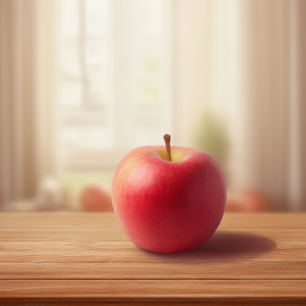
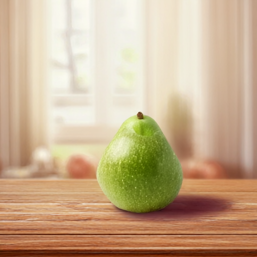

# libQwenImage21 — Qwen-Image-2.1 on Android

Run [Qwen-Image-2.1](https://huggingface.co/Qwen/Qwen-Image-2.1) **text-to-image and image editing fully on-device** on
Android phones, with [MNN](https://github.com/alibaba/MNN), int4 weights and the OpenCL GPU backend.

This repo contains an Android library (`qwenimage21`, AAR) with a small Java API, a demo app, an adb command-line
tool, and the scripts that convert the original model to MNN. Converted models are on Hugging Face:
**[evankuo/Qwen-Image-2.1-MNN](https://huggingface.co/evankuo/Qwen-Image-2.1-MNN)**.

<p>



</p>

*Generated on a Snapdragon 8 Gen 2 phone, 512×512. Left: 8 steps, "A red apple on a wooden table, soft window light,
photorealistic". Middle: 20 steps, "A cozy coffee shop on a rainy evening, warm light…".*

<p>


</p>

*Same MNN model files, run with the CPU backend on a Mac, 8 steps. Left: image edit of the apple picture above with
"Replace the red apple with a green pear, keep everything else the same". Right: 576×448, "A lighthouse on a rocky coast
at sunset, dramatic clouds".*

## Status

| | |
|---|---|
| Modes | text-to-image, image editing (one input image) |
| Resolution | ~512×512 pixels at any aspect ratio (sides multiple of 32): 512×512, 576×448, 608×416, 672×384, … |
| Tested device | Snapdragon 8 Gen 2 (Adreno 740), 16 GB RAM, Android 13 |
| Speed | ~19.7 s per denoising step on OpenCL fp16; ~490 s for 20 steps end to end |
| Model download | ~10.3 GB (text encoder + vision 5.4 GB, DiT 4.5 GB, VAE 0.7 GB) |
| Requirements | arm64 Android 8.0+ (API 26), OpenCL GPU, **12 GB+ RAM recommended**, ~11 GB free storage |

Timing breakdown (20 steps): text encoder (CPU) 13–16 s · text K/V prefix 1–2 s · DiT 20 × 19.7 s · VAE (CPU) 25–40 s.

This is a first working port; see [Limitations](#limitations).

## Quick start (demo app)

1. Build and install the demo (or grab the APK from Releases):
   ```bash
   git clone --recursive https://github.com/scsonic/libQwenImage21.git
   cd libQwenImage21
   ./gradlew :demo:installDebug
   ```
2. Get the models, either
   - in the app: tap **Download models from Hugging Face** (resumable, ~10 GB), or
   - from a computer:
     ```bash
     hf download evankuo/Qwen-Image-2.1-MNN --local-dir models/qwen_image21
     scripts/push_models.sh models/qwen_image21        # -> /sdcard/Android/data/com.scsonic.qwenimage21.demo/files/qwen_image21
     ```
3. Pick the **Text → Image** or **Image Edit** tab, enter a prompt (or reuse one from **History**), choose a size or
   an input image, and tap **Generate** / **Edit image**.

If a stage does not fit in memory the app shows an *out of memory* dialog and you can simply try again (e.g. after
closing other apps or choosing another size). If Android kills the app anyway, the next launch tells you which stage and
settings ran out of memory.

## Using the library

Add the module to your project (or use the AAR from `./gradlew :qwenimage21:assembleRelease`):

```groovy
// settings.gradle
include ':qwenimage21'
project(':qwenimage21').projectDir = new File('/path/to/libQwenImage21/qwenimage21')

// app/build.gradle
android { defaultConfig { ndk { abiFilters 'arm64-v8a' } } }
dependencies { implementation project(':qwenimage21') }
```

```java
import com.scsonic.qwenimage21.ModelDownloader;
import com.scsonic.qwenimage21.QwenImage21;

File modelDir = new File(context.getExternalFilesDir(null), "qwen_image21");

// Background thread: everything below blocks for seconds to minutes.
if (QwenImage21.missingFiles(modelDir) != null) {
    new ModelDownloader().download(modelDir, (file, done, total) -> { /* progress */ });  // needs INTERNET
}

QwenImage21.Options options = new QwenImage21.Options();   // defaults: DiT on GPU, text encoder + VAE on CPU
options.crashMarkerFile = new File(context.getFilesDir(), "qwen_marker.txt");   // optional, see below
try (QwenImage21 qi = new QwenImage21(modelDir, options)) {
    // text-to-image
    Bitmap a = qi.generate("A red apple on a wooden table", QwenImage21.Size.LANDSCAPE_4_3, /*steps*/ 20,
                           /*seed*/ 42, new File(context.getCacheDir(), "a.png"), p -> Log.d("QI", p + "%"));
    // image editing: output keeps the input's aspect ratio at ~512x512 pixels
    Bitmap b = qi.edit("Change the background to a sunset beach", inputJpgOrPng, 20, 42,
                       new File(context.getCacheDir(), "b.png"), null);
} catch (QwenImage21Exception e) {
    if (e.isOutOfMemory()) { /* show "out of memory"; the instance is still usable, retry later */ }
}
```

**Errors and memory.** Before each stage (text encoder, VAE encoder, DiT, VAE decoder) the native side compares the
device's `MemAvailable` with that stage's estimated need and fails with `QwenImage21Exception.OUT_OF_MEMORY` instead of
getting killed; allocation failures inside MNN are reported the same way. All buffers are released on failure, so
calling again is safe. A process killed by Android's low-memory killer cannot be caught: set
`Options.crashMarkerFile`, and at startup `QwenImage21.readCrashMarker(file)` returns the stage and settings of a run
that never finished (or `null`).

`QwenImage21.Size` has presets around 512×512 pixels: 1:1 512×512, 4:3 576×448, 3:4 448×576, 3:2 608×416,
2:3 416×608, 16:9 672×384, 9:16 384×672. `generate(prompt, width, height, …)` takes any multiple of 32.

| `Options` field | Default | |
|---|---|---|
| `useGpu` | `true` | DiT on OpenCL (fp16). `false` runs everything on CPU (much slower). |
| `textEncoderOnCpu` | `true` | Qwen3-VL-8B text encoder on CPU; it runs once per prompt. |
| `vaeOnCpu` | `true` | Keep `true` for now, see limitations. |
| `keepModelsLoaded` | `false` | Keep all stages resident between images. Faster repeats, far more RAM. |
| `crashMarkerFile` | `null` | File used to report runs killed by the system on the next start. |
| `threads` | `4` | CPU threads for the CPU stages. |

The output PNG is **RGBA**: Qwen-Image-2.1 can generate transparent images (prompt e.g. *"This is an RGBA image
with transparency. … The image has alpha channel and the background is transparent."*).

Native logs use the logcat tags `MNNJNI` (per-stage timings) and `QwenImage21`.

## Command line (adb)

```bash
ANDROID_NDK=/path/to/ndk scripts/build_libmnn_android.sh     # also builds the CLI
scripts/push_models.sh models/qwen_image21
adb shell "cd /data/local/tmp/qwen && LD_LIBRARY_PATH=. ./qwen_image21_demo \
    /sdcard/Android/data/com.scsonic.qwenimage21.demo/files/qwen_image21 /sdcard/out.png \
    'A red apple on a wooden table' 20 42 opencl 0 1 576x448 low 4 1"
# image edit: append the input image
adb shell "cd /data/local/tmp/qwen && LD_LIBRARY_PATH=. ./qwen_image21_demo <model_dir> /sdcard/edit.png \
    'Make it winter, snow on the ground' 20 42 opencl 0 1 512 low 4 1 /sdcard/input.jpg"
```

Arguments: `<model_dir> <out.png> <prompt> [steps=20] [seed=42] [opencl|cpu] [memory_mode=0] [te_on_cpu=1]
[size=512|WxH] [precision=low|normal|high] [threads=4] [vae_on_cpu=0] [input_image]`.
Set `QWEN_IMAGE21_DUMP=<dir>` to dump intermediate tensors (compare with `export/compare_dump.py`).

## How it works

Qwen-Image-2.1 = Qwen3-VL-8B text encoder + 7B single-stream DiT (32 blocks) + VAE with an RGBA decoder.

```
prompt ─► Qwen3-VL-8B (MNN LLM, int4, CPU) ─► last-layer hidden states (pre-norm), system tokens dropped
       ─► txt_in + DiT prefix pass (t = 0, causal)   ─► text K/V for all 32 blocks      (once per prompt)
noise  ─► [img_in + DiT step over 1024 image tokens, attending to cached text K/V] × N ─► Euler (flow matching)
       ─► VAE decoder ─► 512×512 RGBA PNG
```

- **Image editing** feeds the input image twice: to the Qwen3-VL vision tower (so the text encoder "sees" it) and
  through the VAE encoder into latent tokens. The DiT prefix becomes `[text | condition-image latents | text]` with a
  block-causal mask (the image block is bidirectional) and multi-block RoPE, and is cached like the text-only prefix.
- Qwen-Image-2.1 uses block-causal attention: text tokens never see the image, and text/condition tokens are
  modulated with t = 0. So the text K/V are computed **once**, and each step only runs the image tokens. This is
  diffusers' `use_kv_cache=True` path.
- **DiT weights = GGUF Q4_K, copied losslessly.** A Q4_K sub-block of 32 weights (`w = d·sc·q − dmin·m`) is exactly
  MNN's asymmetric int4 with block size 32 (`zero = 8·d·sc − dmin·m`, `scale = d·sc`), so the
  [leejet/Qwen-Image-2.1-GGUF](https://huggingface.co/leejet/Qwen-Image-2.1-GGUF) weights are re-packed, not
  re-quantized (`export/q4k.py`). Linears are exported to ONNX as weight-less `FakeLinear` ops and rebuilt into
  quantized MNN convolutions layer by layer, so the 7B model converts on a laptop in about 20 s.
- **Text encoder:** Qwen-Image-2.1's `text_encoder` is byte-identical to Qwen3-VL-8B-Instruct, so the existing
  [taobao-mnn/Qwen3-VL-8B-Instruct-MNN](https://huggingface.co/taobao-mnn/Qwen3-VL-8B-Instruct-MNN) export is used.
  A small MNN change (`hidden_states_output` in the LLM config) returns the last decoder layer before the final RMSNorm.
- **VAE in fp16:** the decoder's residual stream peaks around 3.5e5, which overflows fp16. The export divides the
  stream by 256 (exact, a power of two; every residual branch starts with a scale-invariant RMSNorm) and makes RMSNorm
  pre-divide by `max|x|`. Output is unchanged.

The inference code lives in MNN: [`scsonic/MNN` branch `qwen-image-21`](https://github.com/scsonic/MNN/tree/qwen-image-21)
(`transformers/diffusion/engine/src/qwen_image21_diffusion.cpp`), included here as the `third_party/MNN` submodule.

## Building from source

| Step | Command |
|---|---|
| libMNN.so for the AAR (+ CLI) | `ANDROID_NDK=… scripts/build_libmnn_android.sh` |
| APK / AAR | `./gradlew :demo:assembleDebug :qwenimage21:assembleRelease` |
| Host MNNConvert | `scripts/build_mnnconvert_mac.sh` |
| Re-convert the models | `pip install -r export/requirements.txt && scripts/convert_models.sh` |

A prebuilt `libMNN.so` and the needed headers are checked in under `qwenimage21/src/main/`, so building the APK does
not require building MNN.

Verification scripts in `export/`: `test_equiv.py` (re-implementation vs. diffusers), `test_mnn.py` (MNN vs. torch),
`compare_dump.py` (on-device dumps vs. torch).

## Limitations

- **Speed:** ~20 s per step. MNN's fused Attention op gives wrong results for this model's masks, so the DiT is exported
  without `--transformerFuse` and attention runs as plain matmul + softmax. Fixing that, tuning the OpenCL int4 GEMM,
  or a QNN/HTP backend should all help.
- **VAE on GPU:** running the VAE decoder on OpenCL at 512×512 exhausted memory and rebooted the test phone, so it runs
  on the CPU. It still peaks at several GB there; tiled decoding is the next step.
- **Memory:** stages are loaded one at a time (text encoder → DiT → VAE) and released after use. Phones with less than
  12 GB of RAM are untested.
- Image editing supports one input image (Qwen-Image-2.1 can take up to 10). Its prefix is ~1000 tokens longer, so the
  prefix pass takes about one extra step.
- On MNN's CPU backend, `Memory_Low` (dynamic int8 GEMM) returned wrong results for long prefixes, so the CPU DiT
  runtime uses `Memory_Normal`.
- No CFG (Qwen-Image-2.1 is meant to be sampled without it). The default is 20 steps; the official default is 40.

## Repository layout

| Path | |
|---|---|
| `qwenimage21/` | Android library: `QwenImage21`, `ModelDownloader`, JNI, prebuilt `libMNN.so` + headers |
| `demo/` | Demo app |
| `export/` | Model conversion + verification (Python) |
| `scripts/` | Build, convert and push scripts |
| `third_party/MNN` | MNN fork with the Qwen-Image-2.1 pipeline (submodule) |

## License

- Code in this repo: Apache-2.0 (see `LICENSE`). MNN is Apache-2.0.
- Model weights (Hugging Face repo): derived from Qwen-Image-2.1, under the
  [Qwen Research License Agreement](https://huggingface.co/Qwen/Qwen-Image-2.1/blob/main/LICENSE). Check its terms
  before any non-research use.

## Acknowledgements

[Qwen-Image](https://github.com/QwenLM/Qwen-Image-2.1) (Alibaba Qwen team), [MNN](https://github.com/alibaba/MNN),
[stable-diffusion.cpp](https://github.com/leejet/stable-diffusion.cpp) for the GGUF conversion, and
[diffusers](https://github.com/huggingface/diffusers) for the reference implementation.

---

## 中文說明

在 Android 手機上**完全離線**跑 Qwen-Image-2.1 文生圖：MNN、int4 權重、OpenCL GPU。
Snapdragon 8 Gen 2（16 GB）上 512×512、20 步約 8 分鐘。

- **快速開始**：安裝 `demo` APK → 在 App 裡按「Download models」（約 10 GB，可續傳），或用
  `hf download evankuo/Qwen-Image-2.1-MNN` 下載後以 `scripts/push_models.sh` 推到手機 → 選「Text → Image」或
  「Image Edit」分頁 → 輸入 prompt（可從 History 取用先前的 prompt）→ Generate。
- **尺寸**：總像素約 512×512，比例可選 1:1、4:3、3:4、3:2、2:3、16:9、9:16；編輯模式依輸入圖比例自動決定。
- **記憶體不足**：每個階段開始前會先檢查可用記憶體，不夠就跳出「記憶體不足」並釋放資源，可以直接再按一次；
  若 App 仍被系統殺掉，下次開啟會顯示是哪個階段、哪組設定記憶體不足。
- **當函式庫用**：引入 `qwenimage21` 模組，`generate(prompt, Size, steps, seed, outPng, listener)` 文生圖、
  `edit(prompt, inputImage, steps, seed, outPng, listener)` 圖片編輯，錯誤丟 `QwenImage21Exception`（`isOutOfMemory()`）。
  要在背景執行緒呼叫。
- **轉檔重點**：DiT 直接用 GGUF Q4_K，無損搬進 MNN int4（block 32）。文字編碼器與 Qwen3-VL-8B-Instruct 權重相同，
  直接用現成的 MNN 版。VAE 用殘差流 ÷256 + RMSNorm 預除 max|x|，讓 fp16 不溢位。
- **已知限制**：每步約 20 秒；VAE 在 GPU 上會吃爆記憶體，所以目前跑在 CPU；編輯只支援一張輸入圖；建議 12 GB 以上 RAM。
- **授權**：程式碼 Apache-2.0；模型依 Qwen Research License。
