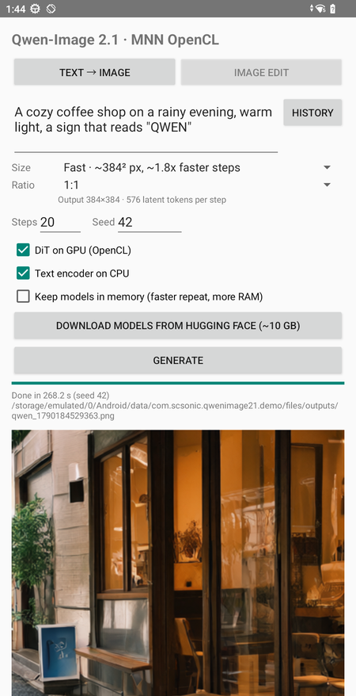

# libQwenImage21 — Qwen-Image-2.1 on Android

Run [Qwen-Image-2.1](https://huggingface.co/Qwen/Qwen-Image-2.1) **text-to-image and image editing fully on-device**
on Android, with [MNN](https://github.com/alibaba/MNN) and the OpenCL GPU backend.

**[中文說明 ↓](#中文說明)**

Android library (`qwenimage21`, AAR), demo app, adb CLI, and model conversion scripts.
Converted models: **[evankuo/Qwen-Image-2.1-MNN](https://huggingface.co/evankuo/Qwen-Image-2.1-MNN)**.
Prebuilt APK/AAR: **[Releases](https://github.com/scsonic/libQwenImage21/releases)**.

> **Recommended: int4 + Turbo** (`dit_turbo.mnn`, fixed 6 steps, ~220 s end to end on a Snapdragon 8 Gen 2). The
> base int4 model gives the same quality at 20+ steps (~450 s). An experimental **2-bit DiT** is also available
> but **not recommended** — it isn't even faster, and a 10-prompt test found it draws the wrong subject entirely
> on 2 of 10 prompts, regardless of step count. Details: [docs/TWOBIT.md](docs/TWOBIT.md).

<p>



</p>

*Left: base model. Middle two: Turbo text-to-image, then an edit of it (same face, new outfit). More samples:
[docs/TURBO.md](docs/TURBO.md). Image-editing gallery (20 outfit/pose edits of one photo): [docs/GALLERY.md](docs/GALLERY.md).*

**Also in this repo:** a distilled [Tiny VAE](docs/TINY_VAE.md) (default — ~200x faster decode, near-identical
output), [multi-reference editing](docs/MULTI_REF.md) (up to 2 images), and a [Download tab](#quick-start-demo-app)
with per-file size/status so you only fetch what you use.

## Status

| | |
|---|---|
| Modes | text-to-image, image editing (1–2 reference images) |
| Resolution | any size, sides a multiple of 32, 128×128 up; 7 ratios × 6 pixel-budget tiers in the app ([Sizes](#sizes)) |
| Tested device | Snapdragon 8 Gen 2 (Adreno 740), 16 GB RAM, Android 13 |
| Speed | int4+Turbo ~220 s end to end at ~512² (6 steps); base int4 ~450 s (20 steps) |
| Model download | ~9.9 GB default (text encoder+vision 5.4 GB, DiT 4.5 GB, tiny VAE 30 MB); Turbo DiT +5.2 GB |
| Requirements | arm64 Android 8.0+, OpenCL GPU, **12 GB+ RAM recommended**, ~11 GB free storage |
| 2-bit DiT | **Not recommended** — see the callout above and [docs/TWOBIT.md](docs/TWOBIT.md) |

Full per-step timings (text-to-image, image editing, Turbo, multiple reference images): [docs/MORE.md](docs/MORE.md#timings).

## Quick start (demo app)

1. Install: grab the APK from [Releases](https://github.com/scsonic/libQwenImage21/releases), or build it:
   ```bash
   git clone https://github.com/scsonic/libQwenImage21.git && cd libQwenImage21
   ./gradlew :demo:installDebug
   ```
2. Open the **Download** tab, check **Standard** + **Turbo** (recommended) or any other combination, tap
   **Download models from Hugging Face** (resumable, checksum-verified) — or from a computer:
   ```bash
   hf download evankuo/Qwen-Image-2.1-MNN --local-dir models/qwen_image21 --exclude "dit_2bit*"
   scripts/push_models.sh models/qwen_image21
   ```
3. On **Text → Image** or **Image Edit**, enter a prompt (or reuse one from **History**), pick a size or an
   input image, and tap **Generate** / **Edit image**. Any option whose model file isn't downloaded yet is
   grayed out with a note on what to fetch.

If a stage doesn't fit in memory the app shows a retryable *out of memory* dialog; if Android kills the app
anyway, the next launch reports which stage and settings ran out.

## Using the library

```groovy
// settings.gradle
include ':qwenimage21'
project(':qwenimage21').projectDir = new File('/path/to/libQwenImage21/qwenimage21')
// app/build.gradle
android { defaultConfig { ndk { abiFilters 'arm64-v8a' } } }
dependencies { implementation project(':qwenimage21') }
```

```java
File modelDir = new File(context.getExternalFilesDir(null), "qwen_image21");

// Background thread — everything below blocks for seconds to minutes.
if (QwenImage21.missingTurboDitFiles(modelDir) != null) {
    new ModelDownloader().download(modelDir, false, true, true, (file, done, total) -> { /* progress */ });
}

QwenImage21.Options options = new QwenImage21.Options();  // DiT on GPU, text encoder + VAE on CPU
options.turbo = true;  // dit_turbo.mnn, fixed 6 steps — the recommended setup
try (QwenImage21 qi = new QwenImage21(modelDir, options)) {
    Bitmap a = qi.generate("A red apple on a wooden table", QwenImage21.Size.LANDSCAPE_4_3, 6, 42,
                           new File(context.getCacheDir(), "a.png"), p -> Log.d("QI", p + "%"));
    Bitmap b = qi.edit("Change the background to a sunset beach", inputJpgOrPng,
                       QwenImage21.Size.Tier.STANDARD, 6, 42, new File(context.getCacheDir(), "b.png"), null);
} catch (QwenImage21Exception e) {
    if (e.isOutOfMemory()) { /* the instance is still usable — retry later */ }
}
```

- **Memory:** each stage checks `MemAvailable` first and throws `QwenImage21Exception.OUT_OF_MEMORY` instead of
  getting killed; buffers are released on failure so calling again is safe. `Options.crashMarkerFile` +
  `QwenImage21.readCrashMarker(file)` catch runs the low-memory killer ends outright.
- Output is **RGBA** — Qwen-Image-2.1 can generate transparent images directly.
- Key `Options`: `turbo` (6-step Turbo — recommended), `dit2Bit` (not recommended, see above), `tinyVae`
  (default true), `refSize` (`FULL`/`HALF` for a 2nd reference image). Logcat tags: `MNNJNI`, `QwenImage21`.

## Sizes

Pick an **aspect ratio** and a **pixel budget** (`Size.of(Ratio, Tier)`; `Size.all()` lists every combination).
Sides keep the area and round to a multiple of 32, so short sides only approximate the ratio — the app shows the
exact output.

| Ratio | Standard ~512² | Fast ~384² | Tiny ~320² (default) | Micro ~256² | Nano ~192² | Pico ~128² |
|---|---|---|---|---|---|---|
| 1:1 | 512×512 | 384×384 | 320×320 | 256×256 | 192×192 | 128×128 |
| 16:9 | 672×384 | 512×288 | 416×256 | 352×192 | 256×160 | 160×96 |
| 9:16 | 384×672 | 288×512 | 256×416 | 192×352 | 160×256 | 96×160 |

(4:3/3:4/3:2/2:3 also available — see `Size.Ratio` / the app's spinner.) Standard wants 16 GB+ RAM; Fast/Tiny
12 GB+; Micro/Nano/Pico are for RAM-constrained devices and aren't quality-evaluated the way the first three are.
**Fast holds an edited subject's identity better than Standard** (same portrait/prompt/seed: Standard tends to
redraw the person, Fast keeps face/hair/pose).

## How it works

```
prompt ─► Qwen3-VL-8B (MNN LLM, int4, CPU) ─► DiT text prefix (cached K/V, once per prompt)
noise  ─► [DiT step over image tokens, attending to cached K/V] × N ─► Euler (flow matching) ─► VAE ─► RGBA PNG
```

- **Image editing** adds the input image through the vision tower and the VAE encoder; the prefix becomes
  `[text | image latents | text]`, cached the same way.
- **DiT weights are GGUF Q4_K, copied losslessly** into MNN's int4 format (`export/q4k.py`) — no re-quantization.
  The optional 2-bit variant does the same with Q2_K (`export/q2k.py`), block size 16.
- **Text encoder** is byte-identical to Qwen3-VL-8B-Instruct, so the existing MNN build is reused as-is.
- **VAE runs in fp16** via a residual-stream rescale (`÷256` + RMSNorm pre-divide) that doesn't change output.
- K/V cache is one tensor per layer, not one big blob, to stay under OpenCL's 1 GiB buffer limit on long edit
  prefixes.

Why MNN/OpenCL over alternatives, and more implementation detail: [docs/MORE.md](docs/MORE.md).
Inference code: [`scsonic/MNN` branch `qwen-image-21`](https://github.com/scsonic/MNN/tree/qwen-image-21).

## Limitations

- ~19 s/DiT step at ~512² on the base model (Turbo: ~22 s/step × 6 instead of 20+).
- VAE decode runs on CPU (it exhausted GPU memory at 512×512 on the test phone) — not an issue with the default
  Tiny VAE, which is small enough for GPU.
- Editing takes 1–2 input images; no CFG (steps default to 20, official default is 40).
- Untested on phones under 12 GB RAM.

## License

Code: Apache-2.0 (`LICENSE`; MNN is also Apache-2.0). Model weights: derived from Qwen-Image-2.1 under the
[Qwen Research License Agreement](https://huggingface.co/Qwen/Qwen-Image-2.1/blob/main/LICENSE) — check its terms
before non-research use.

## Acknowledgements

[Qwen-Image](https://github.com/QwenLM/Qwen-Image-2.1) (Alibaba Qwen team), [MNN](https://github.com/alibaba/MNN),
[stable-diffusion.cpp](https://github.com/leejet/stable-diffusion.cpp) for the GGUF conversion, and
[diffusers](https://github.com/huggingface/diffusers) for the reference implementation.

---

## 中文說明

在 Android 手機上**完全離線**跑 Qwen-Image-2.1 文生圖與圖片編輯：MNN、OpenCL GPU。

> **推薦用法：int4 + Turbo**（`dit_turbo.mnn`，固定 6 步，測試機約 220 秒跑完）。原始 int4 模型 20+ 步也是同樣
> 品質，只是約慢一倍。另外有個實驗性的 **2-bit DiT**，但**不建議使用**——速度沒有比較快，而且拿 10 個不同
> prompt 測試，有 2 個直接把主體畫錯（不管步數多寡），細節見 [docs/TWOBIT.md](docs/TWOBIT.md)。

- **快速開始**：安裝 [Releases](https://github.com/scsonic/libQwenImage21/releases) 的 APK → App 裡切到
  **Download** 分頁，勾選 Standard + Turbo（推薦）後按「Download models」（可續傳、會驗證 checksum）→ 切到
  **Text → Image** 或 **Image Edit** → 輸入 prompt → Generate。選項旁邊若變灰色，代表該功能需要的模型檔案還
  沒下載，小字會說明要去 Download 分頁抓什麼。
- **尺寸**：比例（1:1/4:3/3:4/3:2/2:3/16:9/9:16）和大小（Standard ~512²、Fast ~384²、Tiny ~320²【App 預設】、
  Micro/Nano/Pico 更小，給記憶體吃緊的裝置用，畫質未完整評估）分開選，App 會顯示實際輸出尺寸。**編輯時 Fast
  比 Standard 更容易保住原本人物**（同張人像同 prompt/seed，Standard 容易整個換掉）。
- **為什麼用 MNN / OpenCL**：OpenCL 是目前 Android 上最快的通用 GPU 路徑；NPU 需要針對每代晶片各自轉檔，且
  圖片編輯用的 vision tower 還沒辦法上 NPU。詳見 [docs/MORE.md](docs/MORE.md)。
- **記憶體不足**：各階段執行前會先檢查可用記憶體，不夠就跳出可重試的 *Out of memory* 對話框；若系統直接把
  App 殺掉，下次開啟會顯示是哪個階段、哪組設定不足。
- **當函式庫用**：`generate(prompt, Size, steps, seed, outPng, listener)` 文生圖、
  `edit(prompt, inputImage, Tier, steps, seed, outPng, listener)` 圖片編輯，錯誤丟 `QwenImage21Exception`
  （`isOutOfMemory()`），需在背景執行緒呼叫。
- **轉檔重點**：DiT 用 GGUF Q4_K 無損搬進 MNN int4；文字編碼器直接重用 Qwen3-VL-8B-Instruct 的 MNN 版；VAE
  用殘差流 ÷256 + RMSNorm 預除 max|x| 讓 fp16 不溢位。細節見 [docs/MORE.md](docs/MORE.md)。
- **Turbo（推薦）**：[Viggle-turbo](https://huggingface.co/Viggle/Qwen-Image-2.1-viggle-turbo) LoRA，6 步取代
  20–40 步、總時間約減半，以「不合併」方式套用（原 int4 權重不動，LoRA 另存一個 fp16 小分支）。細節見
  [docs/TURBO.md](docs/TURBO.md)。
- **雙參考圖編輯（實驗中）**：編輯模式可加第二張參考圖，不需新模型檔案。細節見 [docs/MULTI_REF.md](docs/MULTI_REF.md)。
- **CI**：push 到 `main` 或打 tag 會自動編出 APK/AAR；打 `v*` tag 會附加到對應的 GitHub Release。
- **更多**：adb command line、原始碼編譯、repo 目錄結構、完整效能表格見 [docs/MORE.md](docs/MORE.md)。
- **授權**：程式碼 Apache-2.0；模型依 Qwen Research License。
