# More image-editing examples

20 edits of the same starting photo — the AI-generated woman from the main README (`sample_woman_448x576.png`),
not a real person. Everything below ran on-device (Snapdragon 8 Gen 2, OpenCL) with the CLI, Fast size (~384²),
20 steps, seed 5, in `image edit` mode. It's one demonstration of how well the model holds onto a subject's face,
hair and body through an edit — see the [Sizes](../README.md#sizes) note on why Fast does this better than Standard.

[← back to the main README](../README.md)

## Outfit changes

Same prompt shape each time: *"Change her clothes to \_\_\_. Keep her face, hairstyle, and body proportions
exactly the same, photorealistic."*

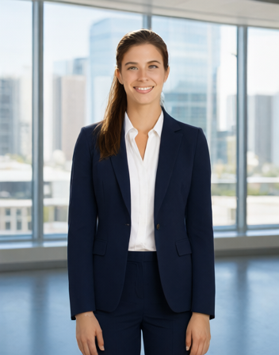
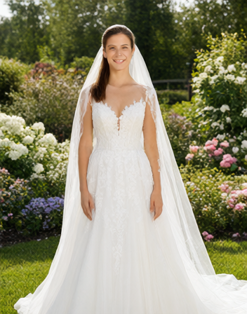
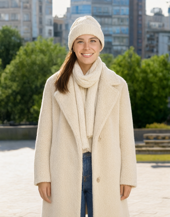
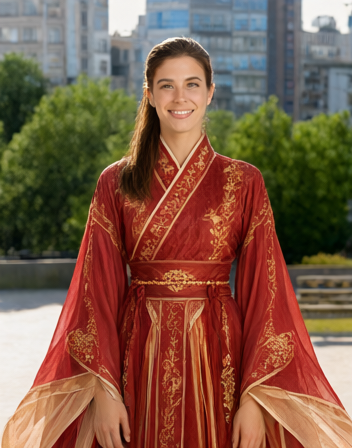
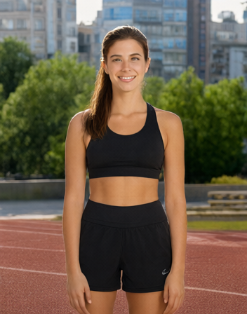

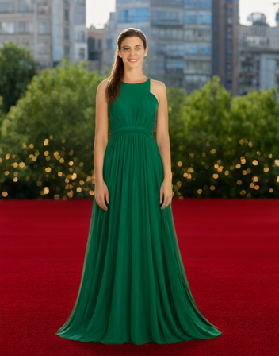
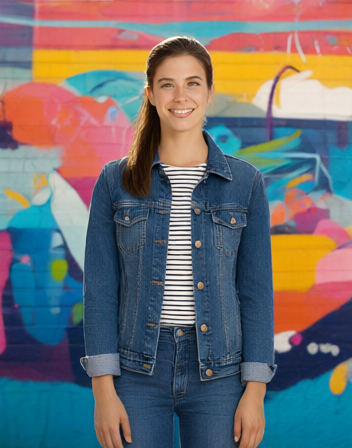
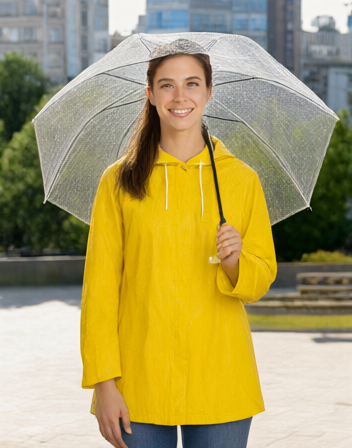
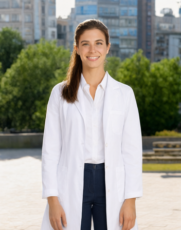

Business suit · wedding dress · winter coat · hanfu · running gear · chef's uniform · evening gown · denim jacket ·
raincoat with umbrella · lab coat.

## Pose and background changes

Same outfit (white t-shirt, jeans) kept fixed; the prompt only asks for a new pose and setting: *"Change her pose
to \_\_\_. Keep her face, hairstyle, and white t-shirt and jeans outfit exactly the same, photorealistic."*

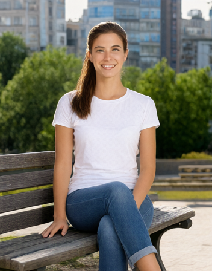
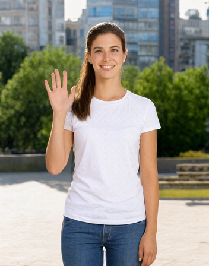
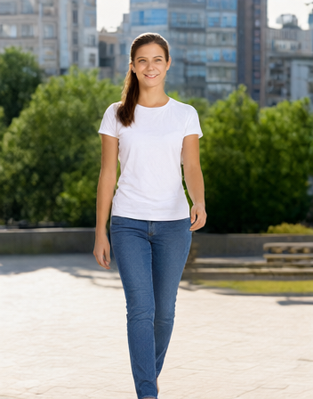
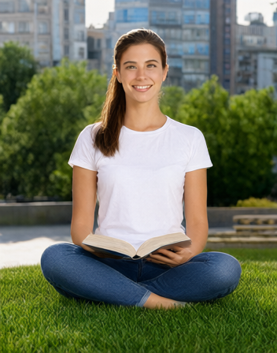
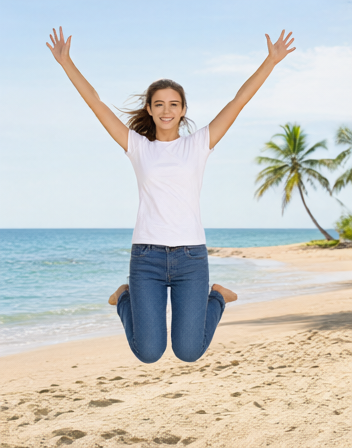

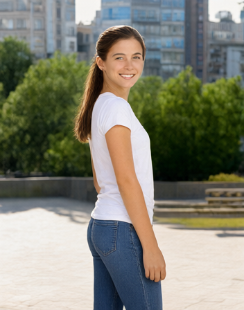
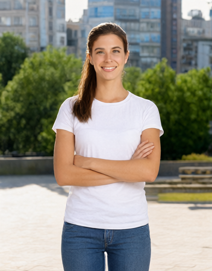
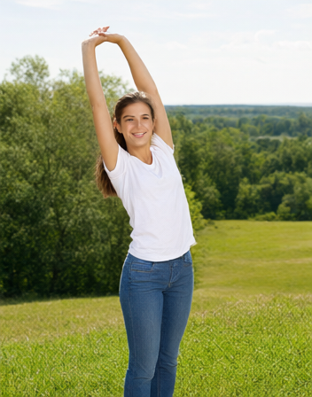
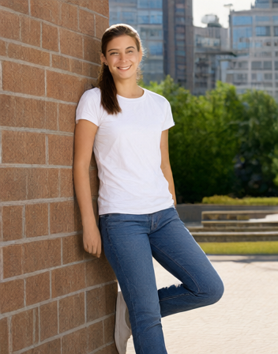
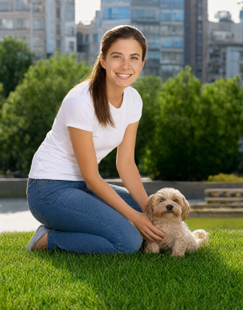

Sitting on a bench · waving · walking · reading on the grass · jumping on the beach · looking back over her
shoulder · arms crossed · stretching · leaning on a wall · kneeling with a dog.

## Notes

- Each edit took about 340 s end to end on the phone (text encoder with vision, VAE encode, 20 DiT steps, VAE
  decode) — see [Status](../README.md#status) for the per-stage breakdown.
- A few prompts (hanfu, chef) kept the requested background less faithfully than others — the outfit change itself
  still came out clean, which is what these are meant to demonstrate.
- Command used for each: `qwen_image21_demo <model_dir> out.png "<prompt>" 20 5 opencl 0 1 384 low 4 1 <base.png>`.
